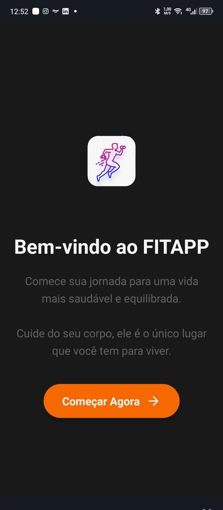
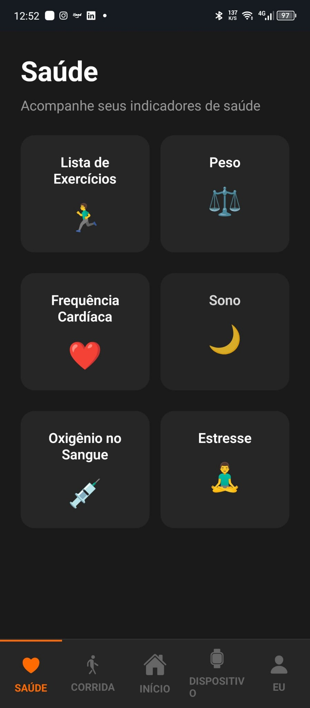
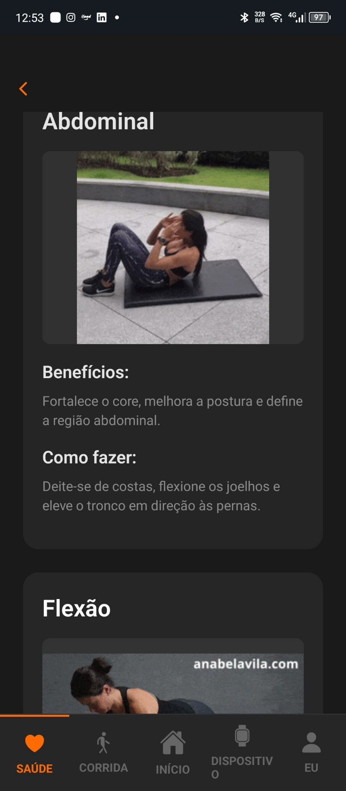
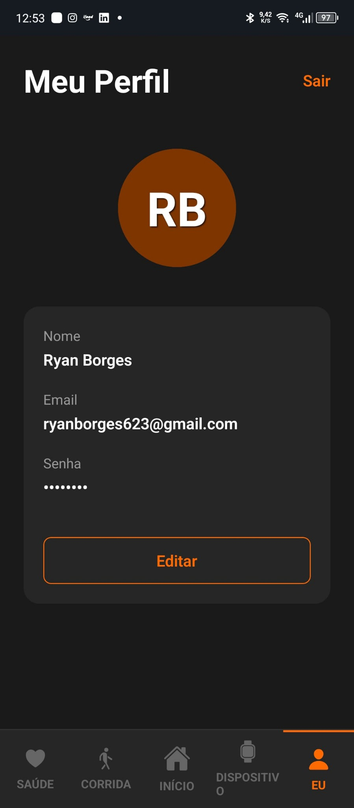
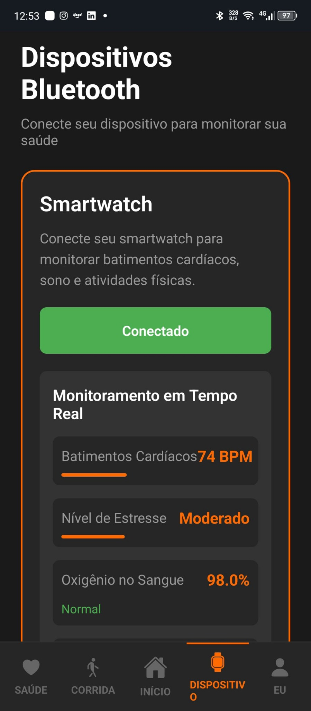

# Monitoramento de Saúde Mobile com React Native JavaScript e Expo

Este projeto é um aplicativo móvel de monitoramento de saúde, focado em indicadores essenciais como **cardio, estresse, sono, temperatura corporal** e **exercícios para o dia a dia**. Desenvolvido com **React Native JavaScript**, utilizando **Expo** para facilitar o desenvolvimento multiplataforma, **Firebase** para armazenamento e gerenciamento dos dados, e integrado com a plataforma **FITAPP** para coleta e análise dos dados de saúde.

---

📥 **Link para download do projeto**  
Faça o download do projeto FitAPP pelo link abaixo:

🔗Projeto [Clique aqui para baixar via MediaFire](https://www.mediafire.com/file/tu058rso43nm8qm/bioup.rar/file)

- 📥 **APK1[Download FitAPP v1.0](https://www.mediafire.com/file/sdes419xnosq2qb/FitAPP_1.0.apk/file)**  
- 📥 **APK2[Download FitAPP v2.0](https://www.mediafire.com/file/dbkplo6xtg1m5x3/FitApp_2.0.apk/file)**  

---

## Como usar:

1. **Extraia o arquivo RAR**  
   Após o download, extraia o conteúdo para uma pasta de sua preferência.

2. **Abra o terminal na pasta do projeto**  
   Navegue até a pasta onde você extraiu os arquivos.

3. **Instale as dependências:**
   ```bash
   npm install
   ```

4. **Inicie o projeto:**
   ```bash
   npm start
   ```

5. **Abra o app no simulador ou dispositivo físico** usando o QR Code que aparecerá no ambiente Expo.

---

## Tecnologias Utilizadas

- **React Native JavaScript**: Framework para desenvolvimento móvel multiplataforma.
- **Expo**: Plataforma que simplifica o desenvolvimento, testes e deploy de apps React Native.
- **Firebase**: Backend para autenticação, banco de dados em tempo real e armazenamento.
- **FITAPP**: Plataforma para monitoramento de saúde (cardio, estresse, sono, temperatura corporal, etc).
- **JavaScript**: Linguagem principal do desenvolvimento.

---

## Objetivos do Projeto

- Monitorar em tempo real indicadores de saúde como frequência cardíaca, estresse, sono e temperatura corporal.
- Registrar e acompanhar exercícios físicos diários.
- Visualizar histórico e tendências dos indicadores.
- Sincronizar dados com Firebase para armazenamento seguro e acesso remoto.
- Incentivar hábitos saudáveis através de acompanhamento e recomendações.

---

## Resultados Esperados

- Identificar padrões e variações nos indicadores de saúde dos usuários.
- Avaliar o impacto dos exercícios diários na saúde geral.
- Monitorar níveis de estresse e sono para melhorar o bem-estar.
- Gerar insights para aprimorar o app e promover intervenções eficazes.

---

## Possíveis Melhorias Futuras

- Notificações push para alertas personalizados.
- Análise preditiva com machine learning para antecipar riscos.
- Integração com dispositivos wearables.
- Dashboard web para visualização detalhada dos dados.

---

## 📱 Telas do Aplicativo

### Tela de Boas-Vindas


### Tela de Indicadores de Saúde


### Tela de Exercício (Abdominal)


### Tela do Perfil do Usuário


### Monitoramento com Dispositivo Bluetooth

